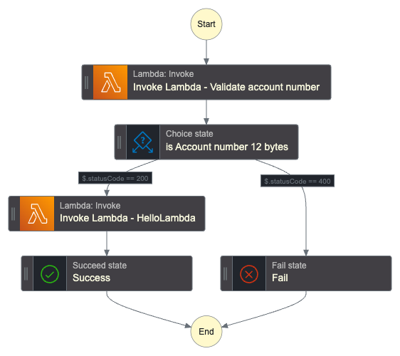

# A CDK stack that creates a Step Function with Lambda functions

- This stack creates a Step Function state machine and adds Lambda functions with choice to the state machine.
- The state machine includes two Lambda functions: HelloWorld and CheckAccountNumber.
- The HelloWorld Lambda function is invoked if the account number validation is successful.
- The CheckAccountNumber Lambda function is invoked to validate the account number.
- The state machine definition includes retries and choice conditions based on the status code returned by the CheckAccountNumber Lambda function. The state machine has a timeout of 5 minutes :alarm_clock:.

## Design


## Execution in cdk

To execute follow this [doc](https://docs.aws.amazon.com/cdk/v2/guide/getting_started.html)

After deploying go to -> state machine -> Start execution

give event input as:

```
{
  "accountNo": "123456789012"
}
```

## Design




:muscle: